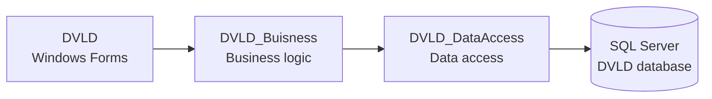

# DVLD — Driving and Vehicle License Department

[](https://learn.microsoft.com/en-us/dotnet/framework/)[](https://learn.microsoft.com/en-us/dotnet/desktop/winforms/)[](https://www.microsoft.com/sql-server)[](LICENSE.txt)

A Windows desktop system for managing people, drivers, driving-license applications, tests, licenses, and related department operations.

> **Project status:** DVLD is a .NET Framework 4.8 Windows Forms application backed by Microsoft SQL Server. The repository does not include a database schema or seed-data script, so a compatible `DVLD` database must be provisioned separately.

## Contents

- [Overview](#overview)

- [Features](#features)

- [Technology stack](#technology-stack)

- [Architecture](#architecture)

- [Requirements](#requirements)

- [Installation and configuration](#installation-and-configuration)

- [Typical workflow](#typical-workflow)

- [Security notes](#security-notes)

- [Known limitations](#known-limitations)

- [Development](#development)

- [License](#license)

## Overview

DVLD provides authenticated staff users with a centralized interface for managing driver-service workflows. The application separates its user interface, business logic, and data-access responsibilities into independent Visual Studio projects.

<details>
<summary><strong>What can DVLD manage?</strong></summary>

DVLD covers people and drivers, local and international license applications, first-time license issuance, license renewal, replacement of lost or damaged licenses, driving tests and appointments, detained licenses, users, application types, and test types.

</details>

## Features

### 🔐 Authentication and users

- Username/password login with active-account checks.

- Optional “Remember Me” behavior.

- User listing, creation, editing, details, and password changes.

- Sign-out and current-user information screens.

### 👥 People and drivers

- Add, edit, find, list, and view people.

- Driver listing and driver-related information.

- License history for a person.

### 🪪 Driving-license applications

- Create and manage local driving-license applications.

- View application details and application lists.

- Issue a driver license for the first time.

- Renew a local driving license.

- Replace a lost or damaged license.

- Create and manage international-license applications.

### 🧪 Tests and appointments

- Manage test types.

- Schedule and list test appointments.

- Record test results.

- Retake tests through the local-license workflow.

### ⚖️ Detained licenses

- Detain licenses.

- List detained licenses.

- Release detained licenses.

### ⚙️ System configuration

- Manage application types.

- Manage test types.

- Manage license classes through the shared business and data-access layers.

## Technology stack

| Area | Technology |
| --- | --- |
| User interface | C# Windows Forms |
| Runtime target | .NET Framework 4.8 |
| Data access | ADO.NET and `System.Data.SqlClient` |
| Database | Microsoft SQL Server |
| Solution format | Visual Studio MSBuild solution (`DVLD/DVLD.sln`) |
| Architecture | UI, business-logic, and data-access projects |

## Architecture

The solution is divided into three projects:

| Project | Responsibility |
| --- | --- |
| `DVLD` | Windows Forms screens, controls, navigation, login, and user interaction. |
| `DVLD_Buisness` | Business entities and application rules. The directory name is intentionally retained from the repository and uses the spelling `Buisness`. |
| `DVLD_DataAccess` | SQL Server queries and persistence operations for people, users, drivers, applications, licenses, tests, and related records. |



> If Mermaid diagrams are not displayed in your viewer, the dependency direction is: `DVLD → DVLD_Buisness → DVLD_DataAccess → SQL Server`.

## Requirements

Before building the application, install or provide the following:

1. Windows, because the application targets Windows Forms on .NET Framework.

1. Visual Studio 2019 or later with the **.NET desktop development** workload.

1. The .NET Framework 4.8 Developer Pack or another environment capable of building .NET Framework 4.8 projects.

1. Microsoft SQL Server with a database named `DVLD`.

1. A SQL Server login with permission to read and write the `DVLD` database.

## Installation and configuration

### 1. Clone the repository

```bash
git clone https://github.com/zmyasser/DVLD.git
cd DVLD
```

### 2. Provision the database

Create a SQL Server database named `DVLD` and load the schema and initial data required by the application. This repository does **not** currently contain a `.sql` database setup or seed-data file, so the database must be obtained or created separately.

The data-access layer expects entities including people, users, drivers, applications, licenses, license classes, application types, test types, test appointments, tests, and detained licenses.

### 3. Configure the SQL Server connection

Update the connection string in:

```
DVLD_DataAccess/clsDataAccessSettings.cs
```

The current implementation defines the connection string directly in source code. Replace the server, database, authentication mode, and credentials with values appropriate for your local SQL Server installation.

For local development, prefer Windows authentication or a local, least-privilege SQL login. Do not commit real passwords or production credentials to source control.

<details>
<summary><strong>Current connection-string location</strong></summary>

The repository currently reads its database connection from `DVLD_DataAccess/clsDataAccessSettings.cs`. Before deployment, move this configuration to a protected configuration source and rotate any credentials that have been exposed in source control.

</details>

### 4. Open and build the solution

Open the following file in Visual Studio:

```
DVLD/DVLD.sln
```

Then select `DVLD` as the startup project and build the solution using **Debug** or **Release** configuration.

### 5. Run the application

Start the `DVLD` project from Visual Studio. The application opens with a login form and displays the main management window after successful authentication against the `Users` table in the configured database.

## Typical workflow

1. Log in as an active system user.

1. Register or locate a person.

1. Create a local driving-license application and select the required license class.

1. Schedule the required tests.

1. Record test results and review the applicant’s progress.

1. Issue the first license after the required conditions are met.

1. Renew, replace, detain, release, or issue an international license as needed.

## Security notes

The repository currently includes a database connection string in the data-access source file. Treat that value as exposed and replace it before using the application outside a local development environment.

The application also supports remembering a username and password through its login workflow. This behavior should be reviewed before deployment because storing credentials locally can create a security risk. A production deployment should use secure credential storage, parameterized configuration, least-privilege database access, and an appropriate password-hashing strategy.

The data-access project uses parameterized SQL commands in its CRUD operations, but database permissions and deployment security remain the responsibility of the operator.

## Known limitations

- The repository does not include a database schema or seed-data script.

- The application is a Windows Forms/.NET Framework application and is not designed to run natively on Linux or macOS.

## Development

When adding functionality, keep responsibilities aligned with the existing project boundaries:

- Put Windows Forms screens and controls in `DVLD`.

- Put domain entities and business rules in `DVLD_Buisness`.

- Put SQL queries and persistence code in `DVLD_DataAccess`.

- Keep database access parameterized and avoid placing credentials in committed source files.

## License

This project is distributed under the license in [`LICENSE.txt`](LICENSE.txt).
